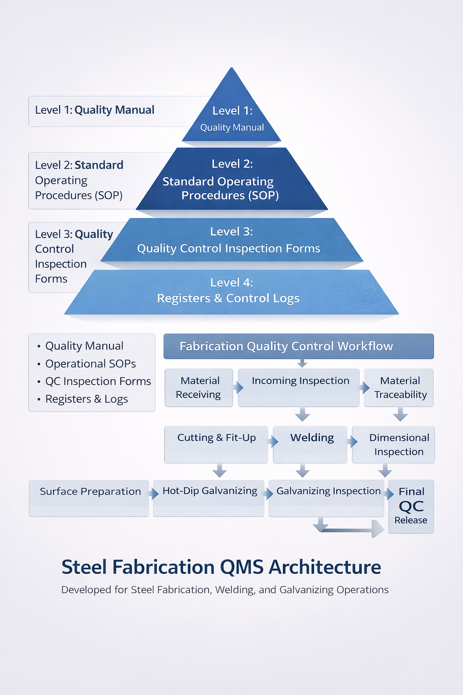

# Steel Fabrication Quality Management System

This repository presents a complete **Quality Management System (QMS)** developed for steel fabrication workshop operations.

The system was developed for **PT Bagja Mulia Technologies** to standardize fabrication processes, improve traceability, and implement structured quality control documentation.

---

# Project Overview

The developed system controls the full fabrication workflow including:

- Material Receiving  
- Incoming Material Inspection  
- Material Traceability  
- Cutting & Fit-Up  
- Welding Operations  
- Dimensional Inspection  
- Surface Preparation  
- Hot-Dip Galvanizing  
- Galvanizing Inspection  
- Final Quality Control Release  

This system integrates operational procedures, inspection checkpoints, and documentation control to ensure fabrication quality and operational consistency.

---

## Project Case Study

### Background

Steel fabrication workshops require structured quality control to ensure that materials, welding operations, and surface treatment processes meet engineering specifications.

Without a documented Quality Management System, fabrication operations may face issues such as inconsistent inspection procedures, lack of traceability, and difficulties during client or regulatory audits.

### Solution Implemented

A complete **Quality Management System (QMS)** was developed to control the fabrication workflow through:

- Standardized operational procedures
- Structured inspection checkpoints
- Welder qualification management
- Equipment calibration control
- Documented inspection records

### Results

The implemented system provides:

- Full traceability of materials and welding activities  
- Standardized inspection workflow  
- Improved documentation control  
- Better readiness for quality audits and client inspections  

---

# System Architecture & Workflow Diagram

The following diagram illustrates the structure of the Quality Management System and the fabrication quality control workflow.



---

# Project Portfolio

The full documentation explaining the development of this Quality Management System can be accessed here:

📄 **QMS Development Portfolio – PT Bagja Mulia Technologies**

[Open Portfolio Document](portfolio/QMS_Development_Portfolio_PT_Bagja_Mulia_Technologies.pdf)

---

# Quality Management System Architecture

The system follows a structured **four-level documentation hierarchy** commonly used in industrial quality management systems.

Level 1  
Quality Manual  

Level 2  
Standard Operating Procedures (SOP)  

Level 3  
Quality Control Inspection Forms  

Level 4  
Registers and Control Logs  

This architecture ensures operational consistency, inspection traceability, and structured documentation management.

---

# System Components

## Quality Manual

Defines the quality management framework including:

- Quality policy  
- Organizational structure  
- Process control  
- Inspection management  
- Non-conformance control  
- Audit and corrective action procedures  

---

## Standard Operating Procedures

Operational procedures control key fabrication processes including:

- Incoming Material Inspection  
- Cutting & Fit-Up Control  
- Welding Process Control  
- Dimensional Inspection  
- Surface Preparation  
- Galvanizing Inspection  
- Final QC Release  

---

## Quality Control Inspection Forms

The system includes **10 inspection documents** used to record verification activities:

- Material Receiving Report  
- Incoming Inspection Checklist  
- Mill Certificate Verification  
- Material Traceability Log  
- Fit-Up Inspection Report  
- Welding Inspection Report  
- Dimensional Inspection Report  
- Surface Preparation Checklist  
- Galvanizing Thickness Report  
- Final Quality Release Certificate  

---

## Welder Qualification Control

A welder qualification register ensures welding activities are performed only by certified welders.

Each weld joint can be traced to:

- Welder identification number  
- Welding process  
- Welding position qualification  
- Certification validity period  

---

## Equipment Calibration Management

Inspection equipment is controlled using:

- Master Equipment Register  
- Calibration Log  

Inspection instruments are tracked by serial number and calibration schedule to ensure measurement accuracy.

---

# Fabrication Quality Control Workflow

The implemented quality workflow follows the sequence of fabrication operations:

Material Receiving  
↓  
Incoming Inspection  
↓  
Material Traceability  
↓  
Cutting & Fit-Up  
↓  
Welding  
↓  
Dimensional Inspection  
↓  
Surface Preparation  
↓  
Hot-Dip Galvanizing  
↓  
Galvanizing Inspection  
↓  
Final Quality Release  

---

# Professional Competencies Demonstrated

This project demonstrates expertise in:

- Quality Management System Development  
- Industrial Process Documentation  
- Welding Quality Control Systems  
- Inspection Workflow Design  
- Material Traceability Systems  
- Equipment Calibration Management  

---

# Repository Structure

```
steel-fabrication-qms-system
│
├── diagrams – QMS architecture and workflow diagrams
├── portfolio – Project portfolio documentation
├── quality-manual – Quality management system manual
├── procedures – Operational procedures
├── qc-forms – Quality inspection documentation
├── welding – Welder qualification documentation
└── registers – Equipment and calibration registers
```

---

# License

This project documentation is released under the MIT License.
